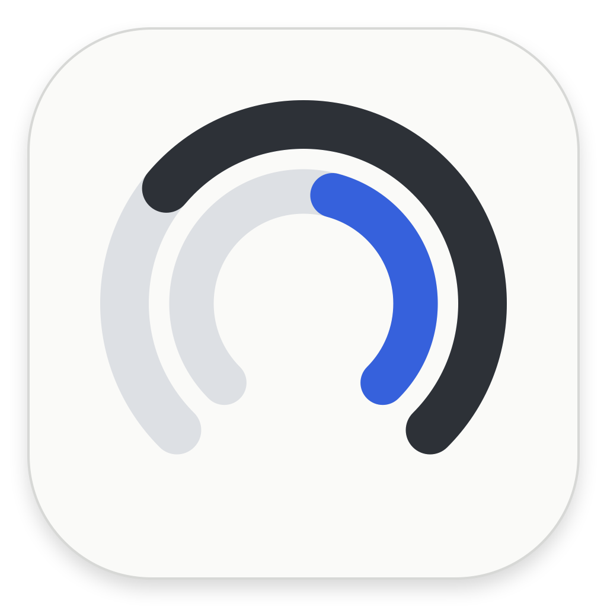
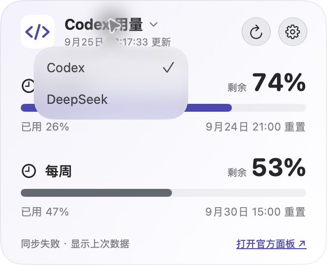
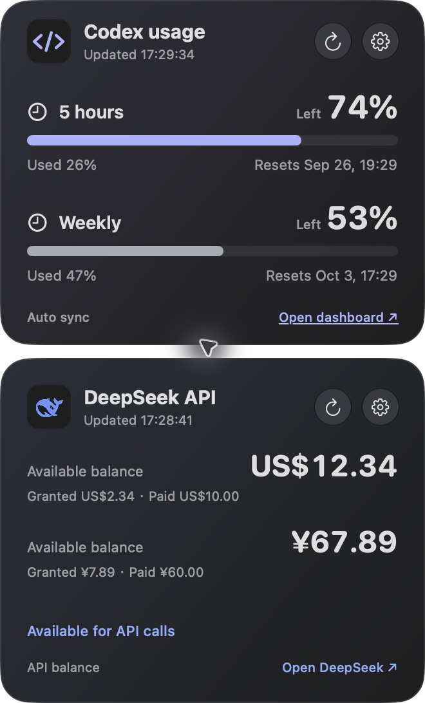

# UsageDesk · AI 用量桌面卡片 / AI usage desktop card

[中文](#中文) · [English](#english) · [v0.2.0 更新日志 / Release notes](docs/releases/v0.2.0.md)



UsageDesk 是可拖动、可置顶的 macOS 桌面卡片，显示本机 Codex 账户的额度窗口和 DeepSeek 开放平台的 API 余额。/ UsageDesk is a movable, always-on-top macOS card for local Codex quota windows and DeepSeek Open Platform API balance.





*截图使用虚构的额度与余额；实际窗口、金额和重置时间取决于你的账户。/ Screenshots use fictional quota and balance values; your account determines the actual windows, amounts, and reset times.*

## 中文

### v0.2.0 更新

- 卡片、文字、标题选择菜单和设置界面适配 macOS 浅色与深色外观。支持的系统会在顶部小型操作按钮使用系统玻璃效果；开启“减少透明度”时使用不透明背景，开启“减少动态效果”时减少切换动画。
- Codex 卡片改为中性色表面与蓝紫色强调，DeepSeek 保留蓝色识别。应用图标改成双环：外环对应 Codex、内环对应 DeepSeek，亮起的弧线表示剩余额度。
- 修复浅色模式下标题菜单文字对比度不足、DeepSeek 金额与“可用余额”标签不齐的问题；空白区域拖动改用屏幕坐标跟踪，避免窗口跳动和闪烁。
- 保留标题下拉选择 Codex/DeepSeek、菜单栏中的“切换卡片”与“垂直展开”、中英双语、可设置刷新间隔及始终置顶。完整条目见[双语更新日志](docs/releases/v0.2.0.md)。

### 安装与使用

1. 下载并解压 [UsageDesk.zip](UsageDesk.zip)，将 `UsageDesk.app` 放入“应用程序”文件夹。适用于 Apple 芯片 Mac，最低版本 macOS 15。已安装旧版时，退出旧版后用新应用替换，已有本地设置和用量数据会保留。
2. 打开应用。按住卡片任意空白区域拖动，位置会自动保存；右上角齿轮打开当前卡片的设置。点击卡片标题和倒三角可选择 Codex 或 DeepSeek。
3. 在菜单栏点击 UsageDesk 图标，可选择卡片布局、语言、刷新间隔、始终置顶，以及显示、隐藏或退出。选择“垂直展开”可同时看到两张卡片。

**Codex：**应用调用这台 Mac 上已登录的 `codex app-server`，通过只读的 `account/rateLimits/read` 获取当前账户实际返回的额度窗口、已用比例和重置时间。卡片右侧显示**剩余比例**；五小时与每周只是可能出现的窗口，具体以账户数据为准。Codex 默认每 10 秒自动刷新，也可选 30 秒、1 分钟、5 分钟或自定义 10–3600 秒。

若本机 Codex 不可用或未登录，可以通过卡片设置手动录入，或从快捷指令执行下列命令。`--primary`、`--secondary` 输入的是**已用百分比**，只需提供当前账户实际有的窗口：

```sh
"$HOME/Applications/UsageDesk.app/Contents/MacOS/UsageDesk" --primary 26 --secondary 47
```

旧参数 `--five`、`--week` 仍分别是主、次窗口的别名。未指定的手动窗口保留旧值；套餐变化后可用 `--clear-primary` 或 `--clear-secondary` 隐藏不再适用的窗口。

**DeepSeek：**点击 DeepSeek 卡片齿轮，输入自己的开放平台 API Key，测试连接后保存。卡片按币种显示可用余额及赠金、充值构成。默认每 60 秒刷新，可选 30 秒至 15 分钟。此卡片**不统计网页聊天用量，也不显示 API 请求数或 Token 消耗**。

### 数据与隐私

Codex 部分不读取、保存或上传 Cookie、`~/.codex/auth.json`。应用通过标准输入和输出与**本机** Codex 子进程通信；Codex 自身可能为获取账户数据连接 OpenAI。用量结果仅存于当前用户的 `~/Library/Application Support/UsageDesk/usage.json`。

DeepSeek API Key 保存在 macOS 钥匙串，仅用于请求 `https://api.deepseek.com/user/balance`；余额快照保存在本地。发布包不含用户 Key、Cookie 或用量快照。读取失败时卡片保留上次成功的数据并提示失败；Codex 仍可手动录入。

### 从源码构建

在装有 Swift 工具链与 macOS 26 SDK 的 Mac 上运行 `python3 scripts/build.py`。脚本在 `work/release/` 生成 Apple 芯片版 `UsageDesk.zip`，解压即可得到应用；可用 `USAGEDESK_SDK` 指定 SDK 路径。发布包使用临时签名，未经过 Apple 公证。

## English

### What's new in v0.2.0

- Cards, text, the title picker, and settings now follow macOS Light and Dark Mode. Small header controls use system glass where supported, with an opaque fallback for Reduce Transparency and less animation for Reduce Motion.
- Codex uses a neutral surface with a restrained indigo accent; DeepSeek keeps its blue identity. The new double-ring app icon represents remaining capacity for Codex on the outer ring and DeepSeek on the inner ring.
- Fixed low-contrast picker text in Light Mode and the vertical mismatch between DeepSeek amounts and their “Available balance” labels. Dragging from empty card space now tracks screen coordinates to avoid jumping and flickering.
- Title-based provider selection, switch/vertical layouts, Chinese/English, configurable refresh intervals, and always-on-top remain available. See the [detailed bilingual release notes](docs/releases/v0.2.0.md).

### Install and use

1. Download and unzip [UsageDesk.zip](UsageDesk.zip), then move `UsageDesk.app` to Applications. It requires an Apple silicon Mac running macOS 15 or later. To upgrade, quit the old app and replace it; local settings and usage data remain in place.
2. Open the app. Drag any empty area to move the card; its position is saved. The gear opens settings for the current card. Click the title and chevron to choose Codex or DeepSeek.
3. Use the UsageDesk menu bar icon to choose layout, language, refresh intervals, and always-on-top, or to show, hide, and quit the app. Vertical layout displays both cards at once.

**Codex:** UsageDesk asks the locally signed-in `codex app-server` for `account/rateLimits/read` over standard input/output. It shows the quota windows, used percentage, and reset times actually returned for your account. The large figure is the **remaining percentage**. Five-hour and weekly windows are examples; your plan determines which windows exist. Codex refreshes every 10 seconds by default, with 30-second, 1-minute, 5-minute, or custom 10–3,600-second options.

If local Codex is unavailable, enter usage manually in the card settings or sync from Shortcuts. `--primary` and `--secondary` take **used percentages**; provide only the windows your account has:

```sh
"$HOME/Applications/UsageDesk.app/Contents/MacOS/UsageDesk" --primary 26 --secondary 47
```

The old `--five` and `--week` flags remain aliases for the primary and secondary windows. Omitted manual windows keep their previous values. Use `--clear-primary` or `--clear-secondary` to hide a window after a plan change.

**DeepSeek:** Open the DeepSeek card's gear, enter your own Open Platform API key, test it, and save. The card shows available balance by currency, split into granted and topped-up amounts. It refreshes every 60 seconds by default, with options from 30 seconds to 15 minutes. It **does not measure web chat usage, API request counts, or token consumption**.

### Data and privacy

The Codex integration does not read, store, or upload cookies or `~/.codex/auth.json`. It talks to a **local** Codex subprocess over standard input/output; Codex itself may contact OpenAI to obtain account data. Usage results stay in the current user's `~/Library/Application Support/UsageDesk/usage.json`.

The DeepSeek API key stays in the macOS Keychain and is sent only to `https://api.deepseek.com/user/balance`; balance snapshots remain local. The release ZIP contains no user key, cookie, or usage snapshot. On read failure, the card keeps the last successful result and shows an error; manual Codex entry remains available.

### Build from source

On a Mac with a Swift toolchain and macOS 26 SDK, run `python3 scripts/build.py`. It creates the Apple silicon `UsageDesk.zip` under `work/release/`; unzip it to get the app. Set `USAGEDESK_SDK` to choose an SDK path. The release app is ad hoc signed and is not notarized by Apple.
