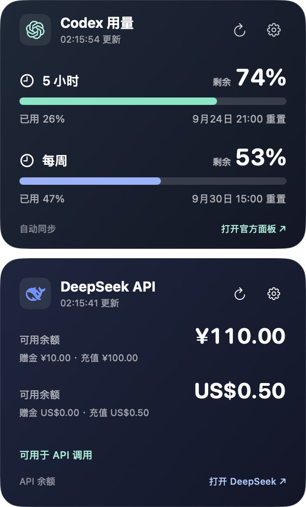

# UsageDesk · AI 用量桌面卡片 / AI usage desktop card

[中文](#中文) | [English](#english)

> v0.1.3 adds DeepSeek API balance, two card layouts, and Chinese/English controls. / v0.1.3 新增 DeepSeek API 余额、双卡片布局与中英双语控制。




*v0.1.3 垂直展开与切换卡片模式。数字为虚构数据；实际额度窗口由当前账户决定。 / v0.1.3 vertical and switch modes with sample data; actual quota windows depend on the current account.*

## 中文

### v0.1.3 功能

v0.1.3 加入 DeepSeek 开放平台 **API 账户余额**、中文/英文切换，以及“切换卡片”或“垂直展开”两种布局。它不统计 DeepSeek 网页聊天用量，也不显示 API Token 消耗。设置中的 DeepSeek API Key 存在本机钥匙串，仅用于请求 DeepSeek 官方余额接口；可随时在设置中删除。Codex 与 DeepSeek 卡片分别采用与深色界面协调的结形和鲸鱼图标。

在菜单栏 UsageDesk 图标中选择卡片布局和语言。选择“切换卡片”后，点击卡片标题旁的倒三角可选择 Codex 或 DeepSeek；选择“垂直展开”则同时显示两张卡片。各卡片右上角的齿轮分别打开 Codex 手动更新和 DeepSeek API 设置。

下载 [`UsageDesk.zip`](UsageDesk.zip)，解压后将 `UsageDesk.app` 放入“应用程序”文件夹。旧版用户可用新版应用替换旧应用；Codex 本地用量数据沿用同一应用目录。

UsageDesk 是一款可拖动、可置顶的 macOS 桌面卡片，显示当前 Codex 账户实际提供的额度窗口、已用比例及重置时间。五小时和每周只是可能出现的窗口，具体以账户返回的数据为准。Codex 默认每 10 秒自动刷新，也可选择 30 秒、1 分钟、5 分钟或自定义 10–3600 秒。DeepSeek 余额默认每 60 秒刷新，设置中可选 30 秒至 15 分钟。

### 安装与使用

1. 下载并解压 [UsageDesk.zip](UsageDesk.zip)，将 `UsageDesk.app` 放入“应用程序”文件夹。适用于 Apple 芯片 Mac，最低系统版本为 macOS 15。
2. 打开应用。按住卡片任意空白处拖动；位置会被记住。
3. 在菜单栏点击柱状图图标，可设置卡片布局、界面语言、刷新间隔和始终置顶，也可显示、隐藏或退出应用。

使用 DeepSeek 卡片时，点击右上角齿轮，输入自己的 DeepSeek 开放平台 API Key，测试连接后保存。设置中可以调整余额刷新间隔或删除 Key。

首次启动时**不预置任何用量数字**。应用会调用这台 Mac 上已登录的 `codex app-server`，通过只读的 `account/rateLimits/read` 方法获取当前账户的用量。读取成功后，卡片只显示实际返回的窗口；没有返回的窗口不会显示。若本机没有可用的 Codex 登录状态，可在卡片中手动输入，或使用快捷指令同步。

手动同步命令中的 `--primary`、`--secondary` 对应主、次窗口的**已用百分比**；卡片右侧显示换算后的**剩余百分比**。只传入当前账户实际有的窗口即可：

```sh
"$HOME/Applications/UsageDesk.app/Contents/MacOS/UsageDesk" --primary 26 --secondary 47
```

旧的 `--five`、`--week` 参数仍可使用，分别作为 `--primary`、`--secondary` 的别名。命令会保留未指定窗口的旧值；如套餐变化，可用 `--clear-primary` 或 `--clear-secondary` 隐藏不适用的窗口。

点击卡片底部“打开官方面板”会在浏览器打开 [Codex 用量页面](https://chatgpt.com/codex/settings/usage)。

### 数据与隐私

Codex 部分没有读取、保存或上传 Cookie、`~/.codex/auth.json` 的逻辑。它启动**本机** Codex 子进程，经标准输入和输出请求用量，并把结果保存在当前 macOS 用户的 `~/Library/Application Support/UsageDesk/usage.json`。本机 Codex 为获取账户数据可能与 OpenAI 服务通信。DeepSeek 部分会把你录入的 API Key 保存在 macOS 钥匙串，并且只将该 Key 发往 `https://api.deepseek.com/user/balance` 读取余额；余额快照保存在本地。安装包不包含用户密钥或用量快照。

自动读取使用的是本机 Codex 的 app-server 协议，可能随 Codex 版本变化。读取失败时会保留上次成功的数据并提示失败，也可继续手动输入。刷新仅在应用运行期间进行。

## English

### v0.1.3 features

v0.1.3 adds DeepSeek Open Platform **API account balance**, a Chinese/English setting, and a choice between switching cards and displaying both vertically. It does not measure DeepSeek web chat usage or API token consumption. Your DeepSeek API key stays in the macOS Keychain and is used only for the official balance endpoint; you can remove it in Settings. The Codex and DeepSeek cards use knot and whale marks styled for the dark cards.

Choose the layout and language from the UsageDesk menu bar icon. In switch mode, click the card title and chevron to choose Codex or DeepSeek; vertical mode shows both cards. The gear on each card opens its own Codex manual update or DeepSeek API settings.

Download [`UsageDesk.zip`](UsageDesk.zip), unzip it, and move `UsageDesk.app` to Applications. If you use an older release, replace the old app; the Codex usage data stays in the same application support folder.

UsageDesk is a movable, always-on-top macOS desktop card for your current Codex account. It shows the **remaining** allowance, used percentage, and reset time for each quota window actually returned by your Codex account. Five-hour and weekly windows are examples, not assumptions about every plan. Codex refreshes every 10 seconds by default; you can choose 30 seconds, 1 minute, 5 minutes, or a custom interval from 10 to 3,600 seconds. DeepSeek balance refreshes every 60 seconds by default, with options from 30 seconds to 15 minutes.

### Install and use

1. Download and unzip [UsageDesk.zip](UsageDesk.zip), then move `UsageDesk.app` to Applications. It requires an Apple silicon Mac running macOS 15 or later.
2. Open the app. Drag any empty area of the card to move it; the position is saved.
3. Use the bar-chart icon in the menu bar to choose the card layout and language, change the refresh interval or always-on-top setting, show or hide the card, or quit.

On the DeepSeek card, click the gear, enter your own DeepSeek Open Platform API key, test the connection, then save it. You can change the balance refresh interval or remove the key in Settings.

A fresh installation shows **no preloaded usage figures**. UsageDesk starts the locally installed, signed-in `codex app-server` and reads `account/rateLimits/read`. After a successful read, the card shows only the windows returned for that account. Missing windows are hidden. If Codex is unavailable or not signed in, you can enter the percentages manually or sync them with Shortcuts.

In the command below, `--primary` and `--secondary` are the **used percentages** for the primary and secondary windows. Provide only the windows your account has. The large numbers show the corresponding **remaining percentages**:

```sh
"$HOME/Applications/UsageDesk.app/Contents/MacOS/UsageDesk" --primary 26 --secondary 47
```

The older `--five` and `--week` flags remain available as aliases for `--primary` and `--secondary`. Omitted windows retain their previous manual values; use `--clear-primary` or `--clear-secondary` to hide a window after a plan change.

The “Open official dashboard” link opens the [Codex usage page](https://chatgpt.com/codex/settings/usage) in your browser.

### Data and privacy

The Codex code does not read, store, or upload cookies or `~/.codex/auth.json`. It starts a **local** Codex subprocess, requests usage over standard input/output, and stores the result for the current macOS user in `~/Library/Application Support/UsageDesk/usage.json`. Codex itself may contact OpenAI services. The DeepSeek API key you enter is kept in the macOS Keychain and sent only to `https://api.deepseek.com/user/balance` to read your balance; balance snapshots remain local. The download contains no user's credentials or usage snapshot.

Automatic reading depends on Codex's local app-server protocol, which may change. On failure, UsageDesk retains the last successful reading and shows an error. Manual entry remains available. Refreshing runs only while the app is open.
