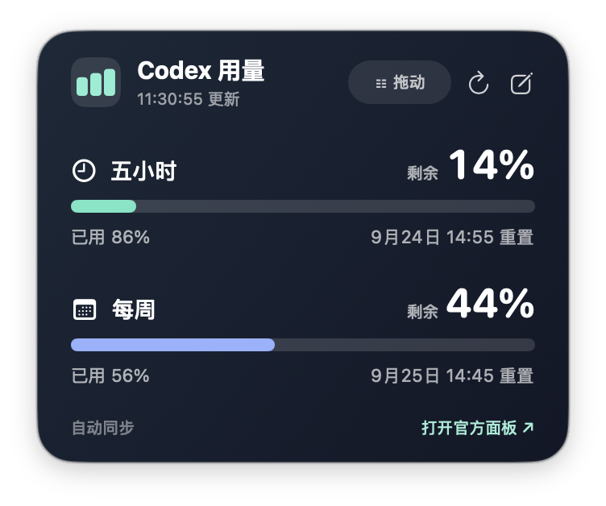

# UsageDesk · Codex 用量桌面卡片

[中文](#中文) | [English](#english)



## 中文

UsageDesk 是一款可拖动、可置顶的 macOS 桌面卡片，显示当前 Codex 账户的**五小时**和**每周**剩余额度、已用比例及重置时间。默认每 10 秒自动刷新，也可选择 30 秒、1 分钟、5 分钟或自定义 10–3600 秒。

### 安装与使用

1. 下载并解压 [UsageDesk.zip](UsageDesk.zip)，将 `UsageDesk.app` 放入“应用程序”文件夹。适用于 Apple 芯片 Mac，最低系统版本为 macOS 15。
2. 打开应用。按住卡片顶部的“拖动”把手移动；位置会被记住。
3. 在菜单栏点击柱状图图标，可显示或隐藏卡片、立即刷新、调整刷新间隔、切换始终置顶，或退出应用。

首次启动时**不预置任何用量数字**。应用会调用这台 Mac 上已登录的 `codex app-server`，通过只读的 `account/rateLimits/read` 方法获取当前账户的用量。读取成功后，卡片才显示数据。若本机没有可用的 Codex 登录状态，可在卡片中手动输入，或使用快捷指令同步。

手动同步命令中的 `--five`、`--week` 是**已用百分比**；卡片右侧显示换算后的**剩余百分比**：

```sh
"$HOME/Applications/UsageDesk.app/Contents/MacOS/UsageDesk" --five 26 --week 47
```

点击卡片底部“打开官方面板”会在浏览器打开 [Codex 用量页面](https://chatgpt.com/codex/settings/usage)。

### 数据与隐私

UsageDesk 的源码没有读取、保存或上传 Cookie、Token 或 `~/.codex/auth.json` 的逻辑。它启动**本机** Codex 子进程，经标准输入和输出请求用量，并把结果保存在当前 macOS 用户的 `~/Library/Application Support/UsageDesk/usage.json`。本机 Codex 为获取账户数据可能与 OpenAI 服务通信；UsageDesk 自身没有向第三方发送用量的代码。安装包不包含用户用量快照。

自动读取使用的是本机 Codex 的 app-server 协议，可能随 Codex 版本变化。读取失败时会保留上次成功的数据并提示失败，也可继续手动输入。刷新仅在应用运行期间进行。

## English

UsageDesk is a movable, always-on-top macOS desktop card for your current Codex account. It shows **remaining** five-hour and weekly allowances, used percentages, and reset times. It refreshes every 10 seconds by default; you can choose 30 seconds, 1 minute, 5 minutes, or a custom interval from 10 to 3,600 seconds.

### Install and use

1. Download and unzip [UsageDesk.zip](UsageDesk.zip), then move `UsageDesk.app` to Applications. It requires an Apple silicon Mac running macOS 15 or later.
2. Open the app. Drag the handle at the top of the card to move it; the position is saved.
3. Use the bar-chart icon in the menu bar to show or hide the card, refresh now, change the refresh interval, toggle always-on-top, or quit.

A fresh installation shows **no preloaded usage figures**. UsageDesk starts the locally installed, signed-in `codex app-server` and reads `account/rateLimits/read`. The card shows figures only after a successful read. If Codex is unavailable or not signed in, you can enter the percentages manually or sync them with Shortcuts.

In the command below, `--five` and `--week` are **used percentages**. The large numbers on the card show the corresponding **remaining percentages**:

```sh
"$HOME/Applications/UsageDesk.app/Contents/MacOS/UsageDesk" --five 26 --week 47
```

The “Open official dashboard” link opens the [Codex usage page](https://chatgpt.com/codex/settings/usage) in your browser.

### Data and privacy

The UsageDesk source has no code to read, store, or upload cookies, tokens, or `~/.codex/auth.json`. It starts a **local** Codex subprocess, requests usage over standard input/output, and stores the result for the current macOS user in `~/Library/Application Support/UsageDesk/usage.json`. Codex itself may contact OpenAI services to obtain account data; UsageDesk has no code that sends usage data to a third party. The download contains no user's usage snapshot.

Automatic reading depends on Codex's local app-server protocol, which may change. On failure, UsageDesk retains the last successful reading and shows an error. Manual entry remains available. Refreshing runs only while the app is open.
